# Discord Unranked Alert Example Application

This example application sends a message to Discord when the RS2
server goes unranked. Server ranked status is checked every 5 seconds.
If the server is unranked, the first message is sent instantly and
after that a message is sent every 15 minutes until the server is ranked again.

Make sure you read [the general example README](../../README.md) first.

There are unlimited ways to deploy applications using `rs2wapy`.
This particular example uses [Heroku](https://www.heroku.com/)
to host the unranked alert bot.

### Directory Structure
Brief explanation of the files in this directory.
```
ranked_alert.py  # example application source code
README.md        # this readme file
```

### Instructions
Detailed steps on setting up this example application.

#### 1. Setting up GitHub
1. Create a GitHub account at https://github.com/join.

2. Fork this example repository https://github.com/tuokri/rs2wapy-examples.
    
    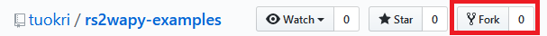
    
    After forking, you will have a copy of this repository
    in your GitHub account.

#### 2. Setting up Heroku
1. Create a free Heroku account. https://signup.heroku.com/

    Free Heroku account allows you to setup free dynos with
    550 run hours each month. If you verify your account 
    with a credit card, you'll receive 1000 free dyno hours 
    each month. This means you can run this example application
    24/7 for free on Heroku. A dyno is a worker, which
    executes application code.

2. Verify your Heroku account with a credit card
(optional, but recommended).

#### 3. Create a Discord Webhook
1. Perform the steps in the **'MAKING A WEBHOOK'** section of this article
https://support.discordapp.com/hc/en-us/articles/228383668-Intro-to-Webhooks

2. Give your Webhook a name and a picture and choose the channel.

We will use the *Webhook URL* later in this guide.

_**DO NOT** perform the steps explained in the
'QUICK EXAMPLE: GITHUB WEBHOOK INTEGRATION' section!
Those steps are irrelevant for this example!_

#### 4. Setup Discord Developer Mode and Role IDs
1. Enable Discord Developer Mode.
    
    

2. Copy desired role ID(s).
    
    Find the role(s) you want to ping when the server
    goes unranked, right click and copy their IDs.
    
        

3. Add role ID(s) to `ranked_alert.py`.

    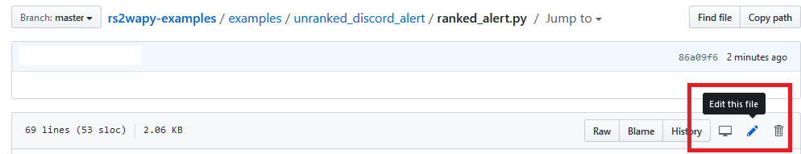

    **Make sure you edit the file in the repository you just forked!**

    Open the file and look at lines 18 to 28.
    The role IDs are stored in the `PING_DISCORD_ROLES` variable.
    Read the comment lines starting with `#` for instructions.
    
4. In `ranked_alert.py` set `RUN = True`
on line number 9.

    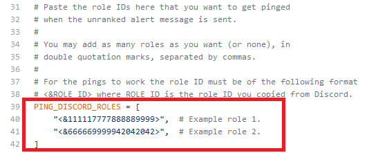

5. Save (commit) the changes.

    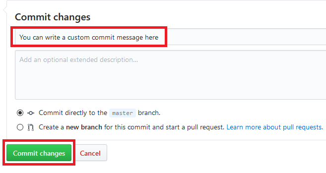

#### 5. Deploy on Heroku
1. Setup a new Heroku app & deploy from GitHub.

    - Go to https://dashboard.heroku.com/apps.
    - Click 'New' (top right corner).
    - Create new app.
    - Give your app a name & choose region.
    - Deployment method: GitHub
    
    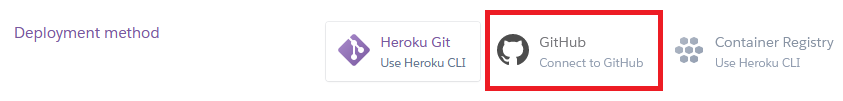

    - Enable automatic deploys.
    
    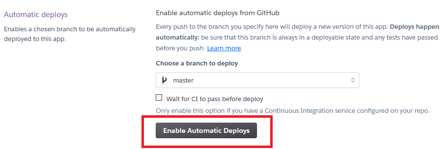

    - Connect to GitHub & choose your repository
    (the one you forked and edited).

2. Setup environment variables.

    - From the top bar, navigate to your app's settings.
    
    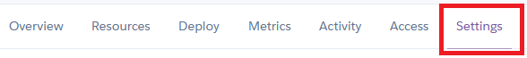
    
    - In settings, choose 'Reveal Config Vars'. Config Vars are your
    environment variables.
    
    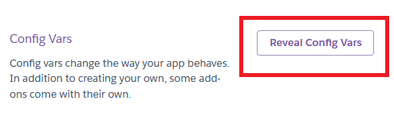
    
    - Setup your environment variables. The variables you see in the image
    are all required! 
    - `DISCORD_WEBHOOK_URL` is the URL we created in [part 3](#3-create-a-discord-webhook) of this guide.
    - Also fill in your WebAdmin details.
    - You may create a new RS2 WebAdmin admin account for this bot, just make
    sure the account has access to the "Current Game" tab.
    
    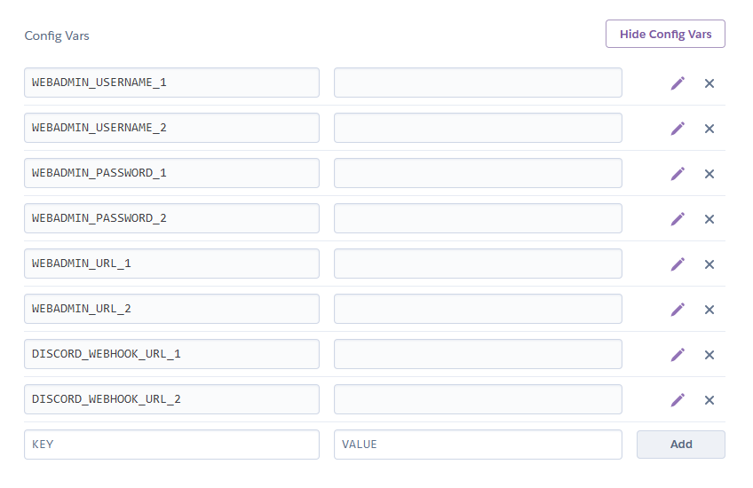

    - Finally, enable the dyno.
    
    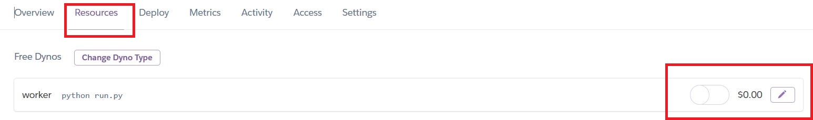
    
    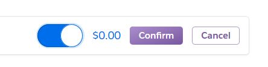

    - Check your app logs.
    
    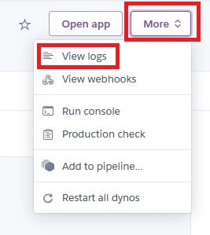
    
    - If everything was setup correctly, your logs should look like this.
    
    

#### 4. All done!